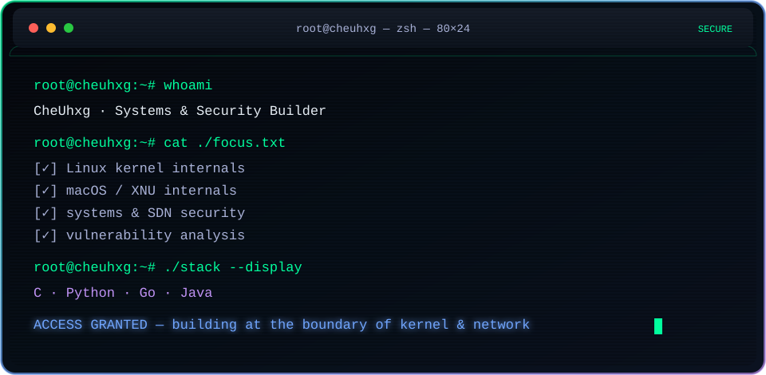

  

  
  
  
  

  

---

### ⚡ Active Modules

<b>🧠 research --show-priorities</b>

<table width="100%">
  <tr>
    <td width="50%" valign="top">
      <b>🐧 Linux Kernel</b> 
      Internals, experiments, kernel notes and operating-system behavior.
    </td>
    <td width="50%" valign="top">
      <b>🍎 macOS / XNU</b> 
      XNU internals, system-call behavior and macOS internals research.
    </td>
  </tr>
  <tr>
    <td width="50%" valign="top">
      <b>🛡️ Systems Security</b> 
      Vulnerability analysis, exploit research methodology and safe experimentation.
    </td>
    <td width="50%" valign="top">
      <b>🌐 SDN / Networking</b> 
      SDN security, intrusion prevention and network-programmability experiments.
    </td>
  </tr>
</table>

<b>🧰 stack --installed</b>

  
  
  
  
  
  
  
  

---

### 📌 Target Repositories

<table width="100%">
  <tr>
    <td width="50%" valign="top">
      <b><a href="https://github.com/CheUhxg/Linux-Kernel-Note">Linux-Kernel-Note</a></b> 
      Linux kernel internals notes and experiment records.  
      
      
      
      
    </td>
    <td width="50%" valign="top">
      <b><a href="https://github.com/CheUhxg/RUC-OS_Kernel_Experiment-2025">RUC-OS Kernel Experiment</a></b> 
      Operating-system kernel coursework, experiments and implementation notes.  
      
      
      
      
    </td>
  </tr>
  <tr>
    <td width="50%" valign="top">
      <b><a href="https://github.com/CheUhxg/BridgeRouter">BridgeRouter</a></b> 
      A security research project by DirtyChain.  
      
      
      
      
    </td>
    <td width="50%" valign="top">
      <b><a href="https://github.com/CheUhxg/XNU-Note">XNU-Note</a></b> 
      macOS XNU internals study notes and experiments.  
      
      
      
      
    </td>
  </tr>
</table>

---

### 📡 Mission Control

  

  
  

  
  

---

### 🐍 Runtime Trace

  <picture>
    <source media="(prefers-color-scheme: dark)" srcset="https://raw.githubusercontent.com/CheUhxg/CheUhxg/output/github-contribution-grid-snake-dark.svg" />
    <source media="(prefers-color-scheme: light)" srcset="https://raw.githubusercontent.com/CheUhxg/CheUhxg/output/github-contribution-grid-snake-light.svg" />
    
  </picture>

  

